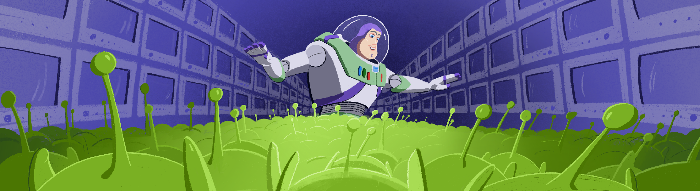

# 3DViewer v1.0

## Preamble

# Документация по коду и приложению 3D Viewer

## Описание

3D Viewer - это приложение, предназначенное для загрузки, визуализации и манипулирования 3D моделями в формате OBJ. Оно позволяет пользователям изменять параметры модели, такие как позиция, вращение, масштаб, а также визуальные параметры, включая цвет ребер, вершин и фон. Приложение также поддерживает съемку скриншотов и создание GIF-анимаций.

## Основные классы и их функции

### MainWindow

Класс `MainWindow` отвечает за основное окно приложения и взаимодействие с пользователем.

#### Основные функции:

- **MainWindow::MainWindow** - конструктор, устанавливающий пользовательский интерфейс и настраивающий начальные параметры.
- **MainWindow::connect_signals_to_slots** - подключение сигналов к слотам для обработки событий.
- **MainWindow::on_GetGif_clicked** - обработка события нажатия на кнопку создания GIF.
- **MainWindow::create_gif** - создание GIF-анимации из текущего отображения модели.
- **MainWindow::on_GetScreenshot_clicked** - обработка события нажатия на кнопку создания скриншота.
- **MainWindow::on_SelectFile_clicked** - обработка события выбора файла модели для загрузки.
- **MainWindow::update_viewer_translation** - обновление положения модели в пространстве.
- **MainWindow::update_viewer_rotation** - обновление угла поворота модели.
- **MainWindow::update_viewer_projection** - переключение между ортографической и перспективной проекциями.
- **MainWindow::change_edge_color** - изменение цвета ребер.
- **MainWindow::change_vertex_color** - изменение цвета вершин.
- **MainWindow::change_edge_thickness** - изменение толщины ребер.
- **MainWindow::change_edge_dashed** - изменение стиля ребер (сплошные/пунктирные).
- **MainWindow::change_vertex_size** - изменение размера вершин.
- **MainWindow::change_vertex_shape** - изменение формы вершин.
- **MainWindow::save_settings** - сохранение настроек приложения.
- **MainWindow::load_settings** - загрузка настроек приложения.

### OpenGLViewer

Класс `OpenGLViewer` отвечает за отрисовку 3D модели с использованием OpenGL.

#### Основные функции:

- **OpenGLViewer::initializeGL** - инициализация OpenGL контекста.
- **OpenGLViewer::resizeGL** - обработка изменения размеров окна.
- **OpenGLViewer::paintGL** - отрисовка текущего состояния модели.
- **OpenGLViewer::mousePressEvent** - обработка нажатия мыши для поворота модели.
- **OpenGLViewer::mouseMoveEvent** - обработка перемещения мыши для поворота модели.
- **OpenGLViewer::keyPressEvent** - обработка нажатий клавиш для перемещения камеры.
- **OpenGLViewer::set_file_path** - установка пути к файлу модели и ее загрузка.
- **OpenGLViewer::reset_rotation** - сброс углов поворота модели.
- **OpenGLViewer::reload_model** - перезагрузка модели из файла.
- **OpenGLViewer::clear** - очистка загруженной модели из памяти.
- **OpenGLViewer::create_model** - создание модели из загруженных данных.
- **OpenGLViewer::create_default_cube** - создание модели куба по умолчанию.
- **OpenGLViewer::set_translation** - установка трансляции модели.
- **OpenGLViewer::draw_grid** - отрисовка сетки на фоне.
- **OpenGLViewer::reset_sliders** - сброс значений слайдеров для трансляции и вращения.

## Пользовательский интерфейс

### Основные элементы:

- **QPushButton** - кнопки для выполнения различных действий (создание GIF, скриншота, выбор файла и т.д.).
- **QSlider** - слайдеры для изменения параметров модели (позиция, вращение, масштаб).
- **QComboBox** - выпадающие списки для выбора формы вершин.
- **QCheckBox** - чекбоксы для включения/отключения пунктирных ребер.
- **QColorDialog** - диалог выбора цвета для изменения цвета ребер, вершин и фона.

## Использование

1. **Загрузка модели**: Нажмите кнопку "Выбрать файл" и выберите файл формата OBJ.
2. **Изменение параметров модели**: Используйте слайдеры для изменения позиции, вращения и масштаба модели.
3. **Изменение визуальных параметров**: Измените цвет ребер, вершин и фона с помощью соответствующих кнопок.
4. **Переключение проекций**: Используйте кнопки для переключения между ортографической и перспективной проекцией.
5. **Создание скриншота**: Нажмите кнопку "Скриншот" и сохраните изображение.
6. **Создание GIF**: Нажмите кнопку "GIF" и сохраните анимацию.

## Настройки

Приложение автоматически сохраняет настройки пользователя при выходе и загружает их при запуске. Настройки включают цветовые параметры, толщину ребер, размер вершин и тип проекции.

### Сохранение и загрузка настроек:

- **MainWindow::save_settings** - сохранение текущих настроек в файл.
- **MainWindow::load_settings** - загрузка настроек из файла при запуске.

## Обработка ошибок

- **MainWindow::show_error** - отображение сообщения об ошибке.
- **MainWindow::show_info** - отображение информационного сообщения.

### Примеры сообщений об ошибках:

- "Error initializing sliders" - ошибка инициализации слайдеров.
- "Error: OpenGLViewer not found" - ошибка поиска виджета OpenGLViewer.
- "No file selected" - файл не был выбран.
- "Error: Selected file does not exist or is not a valid file" - выбранный файл не существует или недействителен.
- "Error setting file path" - ошибка установки пути к файлу.

### Примеры информационных сообщений:

- "GIF saved successfully" - GIF успешно сохранен.
- "Settings saved" - настройки сохранены.
- "Model loaded successfully" - модель успешно загружена.

## Заключение

Приложение 3D Viewer предоставляет пользователям удобный интерфейс для загрузки и визуализации 3D моделей. Благодаря возможности изменять различные параметры и сохранять настройки, приложение подходит как для базового, так и для более продвинутого использования.
